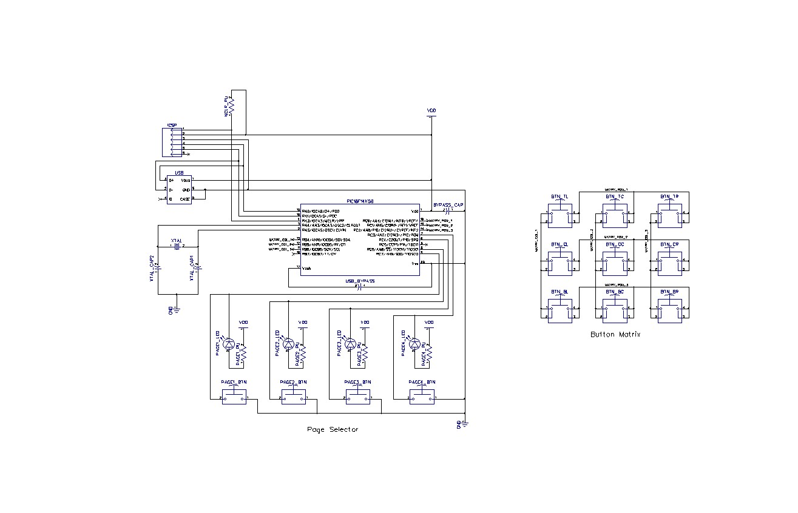

# Palette

Palette is a simple USB device which is thought to be placed on the side of a graphic tablet while doing image editing in order to have easy access to the most frequently used shortcuts. Of course it can be used in other contexts as well.

The project is based around a PIC18F14K50 chip because it supports USB (using an external crystal) and can be powered from 5v without external components. I also had a couple of them lying around, which made the choice obvious.

There is currently one prototype built on veroboard. I am waiting for the PCB to be delivered from China

## Schematics

These are the current schematics (also available under hw/palette.dch (DipTrace)

## PCB

The PCB is available in the hw/palette.dip file (DipTrace)

## TODO

1) Measure and improve power usage
2) Manufacturing
